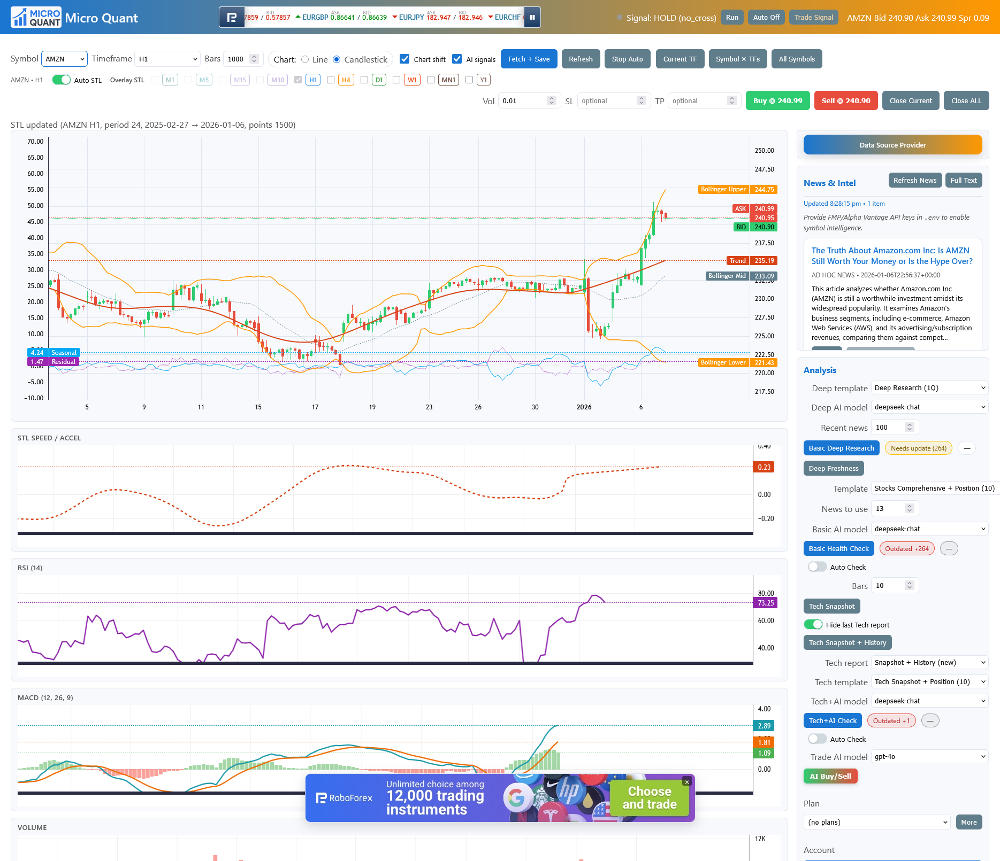

<p align="center">
  
</p>

# MT5 Tornado Starter (Gold Data)

A minimal Tornado + Postgres app that fetches OHLC bars from MetaTrader 5 (via the official Python package) and serves a simple chart UI. Default symbol is `XAUUSD` (gold vs USD).

## Screenshot


## Features
- Fetch bars from MT5: `/api/fetch?symbol=XAUUSD&tf=H1&count=500`
- Persist OHLC into Postgres (`ohlc_bars` table)
- Serve chart UI at `/` using Chart.js (close price line)

## Prereqs
- Ubuntu with MT5 installed via Wine (e.g., `mt5linux.sh`). Ensure the terminal is running and logged in to your demo or real account.
- Python 3.10+
- PostgreSQL running locally; create `metatrader_db` and user `lachlan` (or adjust).

## Setup
```bash
# Windows (PowerShell)
# 1) Create venv with Python 3.11 (MetaTrader5 has no wheels for 3.13 yet)
py -3.11 -m venv .venv
.\.venv\Scripts\Activate.ps1
pip install --upgrade pip
pip install -r requirements.txt

# 2) Configure env
Copy-Item .env.example .env
# Edit .env and set DATABASE_URL, MT5_PATH (e.g. C:\\Program Files\\MetaTrader 5\\terminal64.exe), and your MT5 demo creds
# Load env for this session
Get-Content .env | Where-Object { $_ -and $_ -notmatch '^#' } | ForEach-Object { $n,$v = $_ -split '=',2; [Environment]::SetEnvironmentVariable($n, $v, 'Process') }

# 3) Run app
python -m app.server
# Open http://localhost:8888

# Linux/mac (bash)
python3 -m venv .venv
source .venv/bin/activate
pip install -r requirements.txt

# Alternative: local 3.11 venv (if your Conda env is 3.13)
# Requires python3.11 on your system
# sudo apt install python3.11 python3.11-venv
bash scripts/bootstrap_venv311.sh
source .venv311/bin/activate

# DB (use your own user/password as needed)
# createdb -h localhost -p 5432 -U lachlan metatrader_db

# Configure env (copy and edit)
cp .env.example .env
# then edit .env with your MT5 PATH and credentials
# export env vars into your shell
set -a; source .env; set +a

# Run app
python -m app.server
# Open http://localhost:8888
```

Notes:
- `MT5_PATH` should point to your `terminal64.exe` under the Wine prefix used by the install script.
- You can omit `MT5_LOGIN/MT5_PASSWORD/MT5_SERVER` if your terminal is already running and logged in. If provided, the app will attempt `mt5.login()`.
- Default DB env var is `DATABASE_URL`. If not set, the app tries `DATABASE_MT_URL` then `DATABASE_QT_URL`.

## Endpoints
- `GET /api/fetch?symbol=XAUUSD&tf=H1&count=500[&mode=inc|full][&persist=1]`
  - Fetch from MT5 and upsert to DB. If `persist=1` the server also saves `last_symbol/last_tf/last_count` as the new defaults; background/bulk fetches omit this to avoid overwriting your selection.
- `GET /api/data?symbol=XAUUSD&tf=H1&limit=500` — read from DB for charting
- `GET /api/strategy/run?symbol=XAUUSD&tf=H1&fast=20&slow=50`
  - Run SMA(20/50) crossover. If `TRADING_ENABLED=1` the server will place a market order (very basic demo logic). The UI’s header “Auto” just schedules calls to this endpoint; actual order placement is still gated by `TRADING_ENABLED`.
- `POST /api/trade` — manual Buy/Sell from the UI (also gated by `TRADING_ENABLED`).
- `POST /api/close` — flatten positions (works even when `TRADING_ENABLED=0`):
  - Current symbol: form body `symbol=...`; optional `side=long|short|both` (default `both`).
  - All symbols: `?scope=all` and optional `&side=...`.
  - Response contains `closed_count` and a `closed` array with per-ticket results (retcodes).
- `GET /` — full UI (candles, indicators, STL, news/AI panels, trading controls)

## Schema
See `sql/schema.sql`. Primary key on `(symbol, timeframe, ts)` prevents duplicate bars; inserts use `ON CONFLICT ... DO UPDATE`.

## Troubleshooting
- MT5 initialize failed: set `MT5_PATH` to the exact `terminal64.exe` and ensure the terminal is running once manually.
- Login failed: specify `MT5_SERVER` exactly as shown in the MT5 terminal or omit and rely on the existing session.
- No data for symbol: make sure the symbol exists with your broker and is visible in Market Watch; you can adjust the symbol (e.g., `XAUUSD`, `XAUUSD.a`, `GOLD` depending on broker).
- Postgres connection: ensure `DATABASE_URL` is correct; test with `psql "$DATABASE_URL" -c 'select 1;'`.

## Trading controls & safety
- Environment guard: export `TRADING_ENABLED=0` (default) to disable any auto/place orders originating from `/api/strategy/run` and the manual Buy/Sell buttons. Set `TRADING_ENABLED=1` only for demo environments.
- Header “Auto” button: re-runs the strategy periodically; it never bypasses `TRADING_ENABLED`.
- Close positions (always allowed): the UI has “Close Current” and “Close ALL” with a confirmation modal. Toggle which sides to close (Long/Short). The backend closes by ticket so it works for both netting and hedging accounts.

## STL auto-compute toggle
- STL auto-compute is now controlled per symbol×timeframe via the “Auto STL” switch in the STL panel. Default is OFF (helps avoid UI lag). When ON for a pair/TF, missing/stale STL runs auto-compute; otherwise use the Recalculate buttons.
- The state persists in the DB via `/api/preferences` using keys like `stl_auto_compute:SYMBOL:TF` and also in `localStorage` for fast startup.

## Remembering your last selection
- The server remembers `last_symbol/last_tf/last_count` preferences and injects them into the page.
- The UI also writes `localStorage(last_symbol/last_tf)` on selection so refreshes snap back immediately.
- `?reset=1` on `/` ignores stored prefs for that load only.
- To force a specific default at startup, set `PIN_DEFAULTS_TO_XAU_H1=1` (optional; off by default).

## AI Trade Plan prompt context
- When you request an AI trade plan, the server ensures the latest Basic Health and Tech Snapshot runs exist for the current symbol/TF (creating them if missing) and then builds the prompt with: Basic + Tech + live Technical Snapshot.

## Dev tips
- The UI supports both Line and Candlestick (via `chartjs-chart-financial`).
- For scheduled fetching, add a periodic callback in Tornado that calls `/api/fetch` logic.
  - Or set env on server: `AUTO_FETCH=1 AUTO_FETCH_SYMBOL=XAUUSD AUTO_FETCH_TF=H1 AUTO_FETCH_SEC=60`
  - For demo trading, export `TRADING_ENABLED=1 TRADING_VOLUME=0.1` (use demo accounts only).
